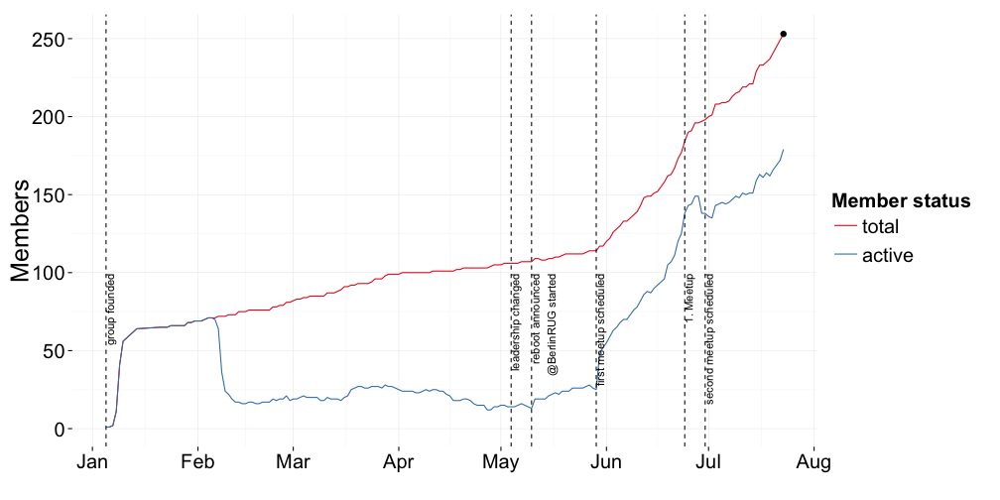

## Schedule for today

Time|What's happening
-------|-------
19:00|doors open
19:15|Konstantin Greger ([@kogreger](https://twitter.com/kogreger)): "Welcome address and brief introduction"
19:20|Berry Boessenkool ([@berryboessenkoo](https://twitter.com/berryboessenkoo)): TBA
19:35|Rick Scavetta ([@Rick_Scavetta](https://twitter.com/rick_scavetta)): "Some New Data Vis Tools in R - visR! 2015""
19:50|Andrew Dolman: "New R Engines and Interpreters""
20:05|Konstantin Greger ([@kogreger](https://twitter.com/kogreger)): "Spatial Analysis in R"
20:05|Michael Rustler: "Creating a Crowd Based Central Knowledge Hub for Reproducible Research with R"
afterwards|socializing & networking
22:00|doors close

--- .class #id &twocol

## Our group sponsors

*** =left

 

*** =right

 

--- .class #id 

## Number of group members

 

--- .class #id 

## Schedule for today

Time|What's happening
-------|-------
19:00|doors open
19:15|Konstantin Greger ([@kogreger](https://twitter.com/kogreger)): "Welcome address and brief introduction"
19:20|Berry Boessenkool ([@berryboessenkoo](https://twitter.com/berryboessenkoo)): TBA
19:35|Rick Scavetta ([@Rick_Scavetta](https://twitter.com/rick_scavetta)): "Some New Data Vis Tools in R - visR! 2015""
19:50|Andrew Dolman: "New R Engines and Interpreters""
20:05|Konstantin Greger ([@kogreger](https://twitter.com/kogreger)): "Spatial Analysis in R"
20:05|Michael Rustler: "Creating a Crowd Based Central Knowledge Hub for Reproducible Research with R"
afterwards|socializing & networking
22:00|doors close
